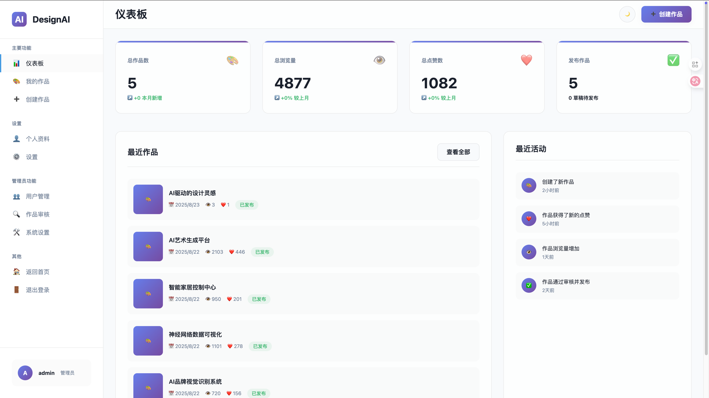
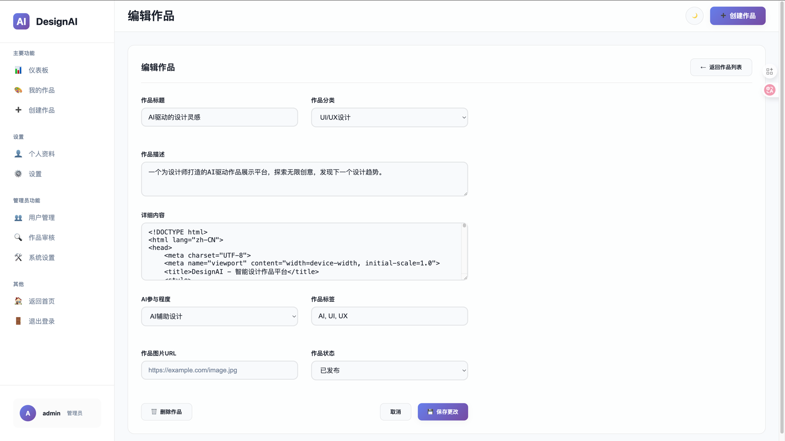
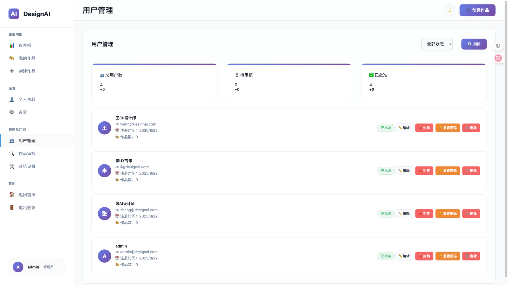
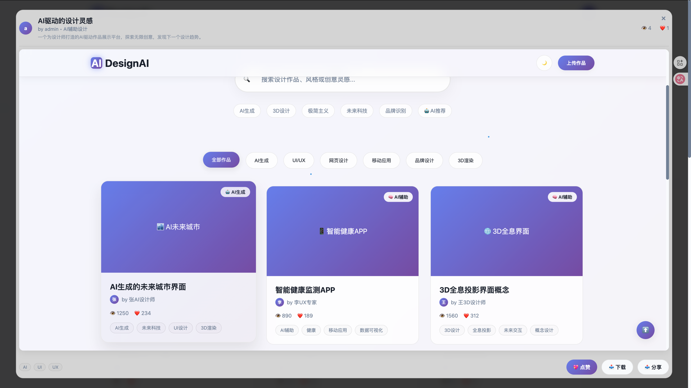

# DesignAI

一个基于Go的AI驱动设计作品展示平台，支持用户管理、作品上传、实时预览和多种认证机制。

## 项目截图

### 主页展示

*响应式设计的主页，支持作品浏览、搜索和分类过滤*

### 作品详情预览

*优化后的详情模态框，iframe撑满显示区域，重点展示UI设计效果*

### 用户仪表板

*个人作品管理、上传和编辑界面*

### 编辑作品

*完整的用户注册、登录和权限管理系统*

### 管理后台

*管理员面板，支持用户审核、作品管理和系统配置*

## 功能特性

### 核心功能
- 🎨 **作品展示** - 支持多种设计分类（AI生成、UI/UX、网页设计、移动应用、品牌设计、3D渲染）
- 👥 **用户系统** - 完整的用户注册、登录、权限管理
- 🔍 **搜索过滤** - 实时搜索、分类过滤、标签检索
- ❤️ **互动功能** - 点赞、浏览统计、评论系统
- 📱 **响应式设计** - 支持桌面端和移动端
- 🌙 **主题切换** - 明亮/暗黑主题支持

### 管理功能
- 👑 **管理员面板** - 用户审核、作品管理、系统设置
- 📊 **数据统计** - 作品浏览量、点赞数、用户活跃度
- 🔐 **权限控制** - 基于角色的访问控制(RBAC)
- 📝 **内容审核** - 作品发布审核流程

### 技术特性
- 🚀 **高性能** - 基于Go和Gin框架
- 💾 **数据持久化** - SQLite数据库，支持GORM ORM
- 🔒 **安全认证** - JWT令牌认证，密码加密
- 🎯 **API驱动** - RESTful API设计
- 📦 **嵌入式资源** - 模板和静态文件内嵌

## 快速开始

### 环境要求
- Go 1.19+
- 无需额外数据库安装（使用SQLite）

### 安装运行

1. **克隆项目**
```bash
git clone <repository-url>
cd design-ai
```

2. **安装依赖**
```bash
go mod tidy
```

3. **运行应用**
```bash
go run main.go
```

4. **访问应用**
- 主页: http://localhost:8080
- 仪表板: http://localhost:8080/dashboard
- 认证页面: http://localhost:8080/auth

### 构建部署

```bash
# 构建可执行文件
go build -o design-ai main.go

# 运行
./design-ai
```

## 项目结构

```
design-ai/
├── main.go                 # 应用入口点
├── CLAUDE.md              # 项目配置和说明
├── README.md              # 项目文档
├── database/              # 数据库相关
│   ├── database.go        # 数据库连接和迁移
│   └── seed.go           # 种子数据
├── handlers/              # API处理器
│   ├── portfolio.go       # 作品相关API
│   └── user.go           # 用户相关API
├── middleware/            # 中间件
│   └── auth.go           # 认证中间件
├── models/               # 数据模型
│   ├── portfolio.go      # 作品模型
│   └── user.go          # 用户模型
├── templates/            # HTML模板
│   └── pages/
│       ├── home.html     # 主页模板
│       ├── dashboard.html # 仪表板模板
│       ├── auth.html     # 认证页面模板
│       └── about.html    # 关于页面模板
├── utils/                # 工具函数
│   └── jwt.go           # JWT工具
└── design_ai.db         # SQLite数据库文件
```

## API接口

### 作品管理
- `GET /api/v1/portfolios` - 获取作品列表
- `GET /api/v1/portfolios/:id` - 获取作品详情
- `POST /api/v1/portfolios` - 创建作品
- `PUT /api/v1/portfolios/:id` - 更新作品
- `DELETE /api/v1/portfolios/:id` - 删除作品
- `POST /api/v1/portfolios/:id/like` - 点赞作品

### 用户管理
- `POST /api/v1/auth/register` - 用户注册
- `POST /api/v1/auth/login` - 用户登录
- `GET /api/v1/profile` - 获取用户资料
- `PUT /api/v1/profile` - 更新用户资料
- `GET /api/v1/my-portfolios` - 获取我的作品

### 管理员功能
- `GET /api/v1/admin/users` - 获取用户列表
- `PUT /api/v1/admin/users/:id` - 更新用户状态
- `DELETE /api/v1/admin/users/:id` - 删除用户
- `GET /api/v1/admin/portfolios` - 获取所有作品
- `PUT /api/v1/admin/portfolios/:id` - 审核作品

## 数据模型

### 用户模型 (User)
```go
type User struct {
    ID        string    `json:"id"`
    Username  string    `json:"username"`
    Email     string    `json:"email"`
    Password  string    `json:"-"`
    Avatar    string    `json:"avatar"`
    Bio       string    `json:"bio"`
    Role      string    `json:"role"`      // user, admin
    Status    string    `json:"status"`    // pending, approved, rejected, banned
    CreatedAt time.Time `json:"createdAt"`
    UpdatedAt time.Time `json:"updatedAt"`
}
```

### 作品模型 (Portfolio)
```go
type Portfolio struct {
    ID          string    `json:"id"`
    UserID      string    `json:"userId"`
    Title       string    `json:"title"`
    Author      string    `json:"author"`
    Description string    `json:"description"`
    Content     string    `json:"content"`     // HTML内容
    Category    string    `json:"category"`    // ai, ui, web, mobile, brand, 3d
    Tags        string    `json:"tags"`        // JSON格式标签数组
    ImageURL    string    `json:"imageUrl"`
    AILevel     string    `json:"aiLevel"`     // AI完全生成, AI辅助设计, 手工设计
    Likes       int       `json:"likes"`
    Views       int       `json:"views"`
    Status      string    `json:"status"`      // draft, published, rejected, deleted
    CreatedAt   time.Time `json:"createdAt"`
    UpdatedAt   time.Time `json:"updatedAt"`
}
```

## 功能说明

### 作品内容预览
- 支持HTML格式的详细作品内容
- 主页作品详情弹窗实时预览
- 后台管理页面实时编辑预览
- 安全的HTML内容渲染

### 用户权限系统
- **普通用户**: 创建、编辑自己的作品，浏览和点赞其他作品
- **管理员**: 完整的用户管理、作品审核、系统设置权限

### 认证安全
- JWT令牌认证机制
- 密码加密存储
- 会话管理和自动登录
- 权限中间件保护

## 配置说明

### 环境变量
- `PORT`: 服务器端口（默认8080）
- `DATABASE_URL`: 数据库连接字符串（默认./design_ai.db）
- `JWT_SECRET`: JWT签名密钥（默认自动生成）

### 数据库配置
应用使用SQLite数据库，首次运行时会自动：
1. 创建数据库文件
2. 执行数据库迁移
3. 插入示例数据

### 模板系统
- 使用Go的`embed`指令嵌入模板文件
- 支持模板继承和组件化
- 模板路径: `templates/pages/*.html`

## 开发指南

### 添加新功能
1. 在`models/`中定义数据模型
2. 在`handlers/`中实现API处理器
3. 在`templates/pages/`中添加模板
4. 在`main.go`中注册路由

### 数据库迁移
```go
// 在 database/database.go 中添加新模型的自动迁移
err = db.AutoMigrate(&models.NewModel{})
```

### API测试
```bash
# 获取作品列表
curl http://localhost:8080/api/v1/portfolios

# 用户登录
curl -X POST http://localhost:8080/api/v1/auth/login \
  -H "Content-Type: application/json" \
  -d '{"email":"user@example.com","password":"password"}'
```

## 技术栈

### 后端
- **Go** - 主要编程语言
- **Gin** - Web框架
- **GORM** - ORM库
- **SQLite** - 数据库
- **JWT** - 认证机制

### 前端
- **HTML5** - 页面结构
- **CSS3** - 样式设计
- **JavaScript** - 交互逻辑
- **Fetch API** - 数据请求

### 工具和库
- `github.com/gin-gonic/gin` - Web框架
- `gorm.io/gorm` - ORM
- `github.com/glebarez/sqlite` - SQLite驱动（CGO-free）
- `github.com/golang-jwt/jwt/v4` - JWT库
- `golang.org/x/crypto/bcrypt` - 密码加密

## 部署建议

### 生产环境
1. 设置环境变量
2. 配置反向代理（Nginx）
3. 启用HTTPS
4. 定期备份数据库
5. 配置日志记录

### Docker部署
```dockerfile
FROM golang:1.19-alpine AS builder
WORKDIR /app
COPY . .
RUN go build -o design-ai main.go

FROM alpine:latest
RUN apk --no-cache add ca-certificates
WORKDIR /root/
COPY --from=builder /app/design-ai .
EXPOSE 8080
CMD ["./design-ai"]
```

## 贡献指南

1. Fork项目
2. 创建功能分支 (`git checkout -b feature/AmazingFeature`)
3. 提交更改 (`git commit -m 'Add some AmazingFeature'`)
4. 推送到分支 (`git push origin feature/AmazingFeature`)
5. 创建Pull Request

## 许可证

本项目采用MIT许可证 - 查看 [LICENSE](LICENSE) 文件了解详情。

## 支持

如有问题或建议，请：
1. 创建Issue
2. 发送邮件至项目维护者
3. 查看文档和代码注释

## 更新日志

### v1.1.0 (最新)
- 🎨 **优化详情模态框布局** - iframe撑满95%视口空间，重点展示UI设计效果
- 📝 **增强作品描述支持** - 在详情模态框中展示作品描述信息
- 🔧 **简化用户体验** - 移除首页上传功能，统一在仪表板进行作品管理
- 💡 **界面优化** - 调整信息布局，优化视觉间距和按钮样式
- 🖼️ **截图展示** - 添加项目功能截图，直观展示平台特性

### v1.0.0
- 初始版本发布
- 基础用户和作品管理功能
- 管理员面板
- 响应式设计
- JWT认证系统